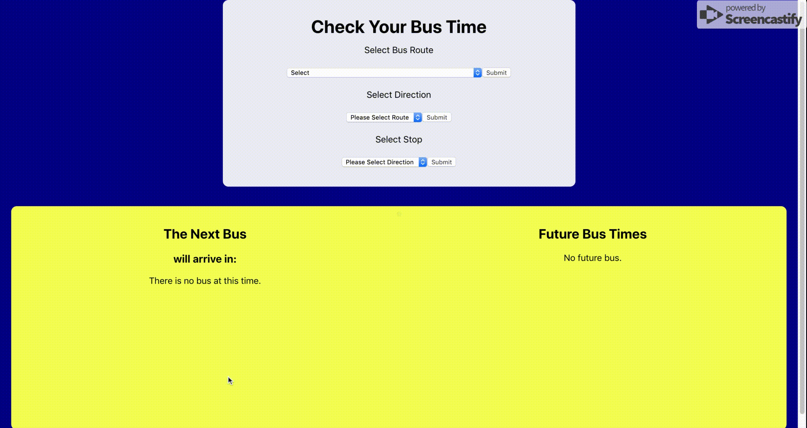

# Metro Transit Api Calls

This application makes API calls to the Metro Transit API (link will be provided below). The goal of this application is to return the next bus time for the users requested bus route, the direction it is heading, and the bus stop. It will take in the users selection in three different drop down menus. Each selection needs to be submitted by clicking the submit button. Once all three inputs are selected and submitted, it will grab from the API and display the next bus arrive, or future bus arrivals.

## Dependencies

Dependencies will include -

```
1. Axios
2. Body-Parser
3. Express.js
4. Jest (for Unit Testing)
5. Parcel-bundler
6. React
7. React-dom
8. React-redux
9. React-scripts
10. Redux
11. Redux-logger
12. Redux-saga

```


## Getting Started

### Prerequisites

Before you get started, make sure you have the following software on your computer -

```
1. Node.js
2. Nodemon
3. VSCode, or preferred coding platform

```

Once you have the necessary software, take these next steps -

```
1. Download or clone the github repository
2. Unzip file, if downloaded
3. In terminal/git bash, make sure to cd into the created folder and do the following steps to load the application
	a) npm install
	b) npm run server
	c) Create a new tab in terminal, or load another git bash screen for this repo
	d) npm run client

```

This should pull the project up through localhost:3000, connected to the server port at localhost:5000.


### Gif of Project


